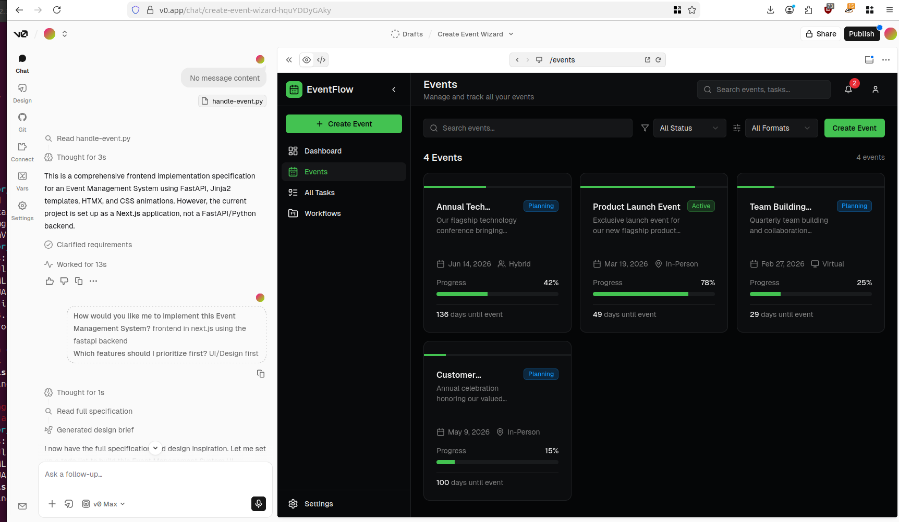

# Meetup Organizing Information Support System

A FastAPI-based meetup organizing system with HTMX-powered frontend, agentic workflows for venue and speaker research, and integrations with Meetup and Luma.

## Features



- **Event Management**: Create, organize, and track meetup events
- **Topic Recommendations**: AI-powered topic suggestions based on historical events
- **Kanban Planning**: Visual task management for event planning
- **Agentic Workflows**: AI agents for venue and speaker research using Perplexity and MiniMax
- **Marketing Materials**: Auto-generate marketing copy for events
- **Sponsor Management**: Track and manage event sponsors
- **Permission Management**: Role-based access control for organizers

## Tech Stack

- **Backend**: FastAPI with SQLAlchemy async
- **Database**: SQLite with 4NF schema
- **Frontend**: Minimal HTML/CSS with HTMX
- **Authentication**: JWT-based with role permissions
- **AI Integration**: OpenAI-compatible API (MiniMax), Perplexity Search

## Setup

1. Install dependencies:
```bash
pip install -r requirements.txt
```

2. Configure environment variables in `.env`:
```
MEETUP_API_KEY=your_meetup_api_key
LUMA_API_KEY=your_luma_api_key
MINIMAX_API_KEY=your_minimax_api_key
PERPLEXITY_API_KEY=your_perplexity_api_key
JWT_SECRET_KEY=your_jwt_secret
DATABASE_PATH=data/meetup.db
```

3. Initialize database:
```bash
python -m app.database.connection
```

4. Run the application:
```bash
uvicorn app.main:app --reload
```

## API Endpoints

### Authentication
- `POST /auth/register` - User registration
- `POST /auth/login` - JWT token generation
- `POST /auth/logout` - Token blacklisting
- `GET /auth/me` - Current user info

### Events
- `GET /events` - List all events
- `POST /events` - Create event
- `GET /events/{id}` - Event details
- `PUT /events/{id}` - Update event
- `DELETE /events/{id}` - Delete event
- `GET /events/{id}/recommendations` - Topic recommendations
- `POST /events/{id}/meetup` - Push to Meetup
- `POST /events/{id}/luma` - Push to Luma

### Kanban
- `GET /kanban/{event_id}` - Get all tasks
- `POST /kanban/tasks` - Create task
- `PATCH /kanban/tasks/{id}` - Update task status
- `PUT /kanban/tasks/{id}` - Edit task

### Venues
- `GET /venues` - List venues
- `POST /venues` - Add venue
- `POST /venues/research` - Trigger venue research agent
- `GET /venues/{id}` - Venue details

### Speakers
- `GET /speakers` - List speakers
- `POST /speakers/research` - Trigger speaker research agent
- `POST /speakers/enrich` - Enrich attendee data
- `GET /speakers/{id}` - Speaker details

### Marketing
- `GET /marketing/{event_id}` - Get materials
- `POST /marketing/{event_id}/generate` - Generate marketing copy
- `PUT /marketing/{material_id}` - Edit material

### Sponsors
- `GET /sponsors` - List all sponsors
- `POST /sponsors` - Create sponsor
- `GET /sponsors/{id}` - Sponsor details
- `PUT /sponsors/{id}` - Update sponsor
- `DELETE /sponsors/{id}` - Delete sponsor
- `POST /events/{event_id}/sponsors/{sponsor_id}` - Link sponsor
- `DELETE /events/{event_id}/sponsors/{sponsor_id}` - Unlink sponsor

### Admin
- `GET /admin/users` - List all users
- `GET /admin/users/{id}` - User details
- `PUT /admin/users/{id}/permissions` - Update user role
- `DELETE /admin/users/{id}` - Deactivate user

## Project Structure

```
cursor_hackathon_26/
├── app/
│   ├── __init__.py
│   ├── main.py                    # FastAPI application entry point
│   ├── config.py                  # Configuration and API placeholders
│   ├── database/
│   │   ├── __init__.py
│   │   ├── connection.py          # SQLite connection management
│   │   └── schemas.py             # SQLAlchemy/Pydantic schemas
│   ├── models/
│   │   ├── __init__.py
│   │   └── database_models.py     # SQLAlchemy ORM models
│   ├── auth/
│   │   ├── __init__.py
│   │   ├── router.py              # Auth endpoints (login, register)
│   │   ├── dependencies.py        # Auth dependencies and guards
│   │   └── utils.py               # Password hashing, JWT handling
│   ├── routers/
│   │   ├── __init__.py
│   │   ├── events.py              # Event CRUD and topic recommendations
│   │   ├── venues.py              # Venue management and research
│   │   ├── speakers.py            # Speaker research and attendee enrichment
│   │   ├── marketing.py           # Marketing material generation
│   │   ├── kanban.py              # Kanban board operations
│   │   ├── sponsors.py            # Sponsor management
│   │   └── admin.py               # Permission management
│   ├── agents/
│   │   ├── __init__.py
│   │   ├── base_agent.py          # Base agent class with tool calling
│   │   ├── venue_research.py      # Venue research agent (Perplexity + MiniMax)
│   │   └── speaker_research.py    # Speaker research agent
│   ├── services/
│   │   ├── __init__.py
│   │   ├── topic_recommender.py   # Historical event-based recommendations
│   │   ├── meetup_service.py      # Meetup API integration
│   │   └── luma_service.py        # Luma API integration
│   └── templates/
│       ├── base.html              # Base HTML template
│       ├── auth.html              # Login/register forms
│       ├── dashboard.html         # Main dashboard with kanban
│       ├── events.html            # Event management
│       ├── venues.html            # Venue research interface
│       └── marketing.html         # Marketing material editor
├── static/
│   ├── style.css                  # Minimal CSS framework
│   └── htmx.min.js                # HTMX library
├── planning/
│   └── planning_prompt.md         # This planning document
└── requirements.txt               # Python dependencies
```
